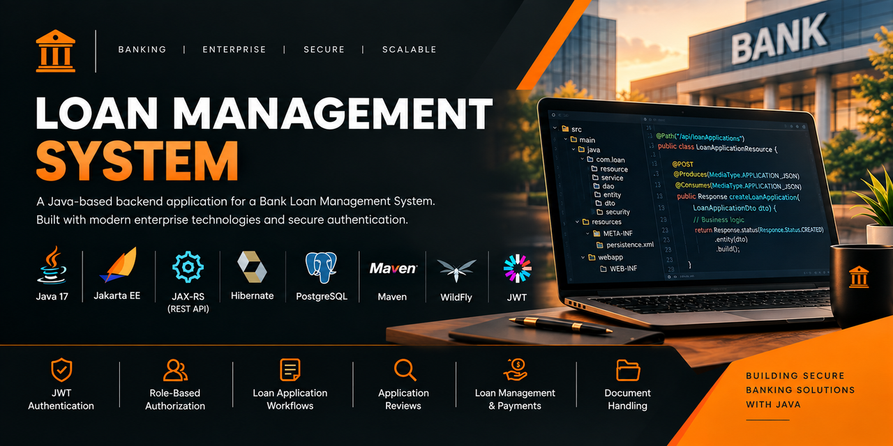

# 🏦 Loan Management System — Backend

A Java-based backend application for a **Bank Loan Management System**, designed to support core banking workflows including customer management, loan applications, application reviews, loan management, and payments.

The backend is built using **Java 17, Jakarta EE, JAX-RS, Hibernate ORM, JPA, PostgreSQL, Maven, and WildFly**. It follows a layered architecture separating REST API handling, business logic, persistence, and security concerns.

> **Project focus:** Enterprise Java • Banking Workflows • REST APIs • JPA/Hibernate • Authentication & Authorization • Layered Architecture

---

## 📌 Project Overview

The Loan Management System manages the loan lifecycle from customer registration and loan application submission through application review, approval/status handling, loan management, and payment operations.

The backend exposes RESTful APIs consumed by a separate frontend application.

The application demonstrates practical experience with:

* Java application development
* Jakarta EE and REST API development
* Object-oriented and layered application design
* Relational database integration
* JPA/Hibernate persistence
* JWT-based authentication
* Role-based authorization
* DTO-based API communication
* Validation and exception handling
* Maven-based enterprise application packaging

---

## ✨ Key Features

### 👤 Customer & User Management

* Customer registration and customer information management
* Customer registration approval workflow
* User account and role management
* OTP-related functionality

### 📝 Loan Application Management

* Create and manage loan applications
* Retrieve customer-specific loan applications
* Track loan application status
* Manage loan application information throughout the application lifecycle

### 🔍 Application Review

* Review submitted loan applications
* Record review decisions and comments
* Associate reviews with the relevant staff member and loan application
* Update application decisions and statuses
* Role-based access to review operations

### 💳 Loan & Payment Management

* Loan record management
* Payment-related operations
* Payment status management
* Loan payment processing workflows

### 📄 Loan Documents

* Upload loan-related documents
* Associate documents with loan applications
* Retrieve application-related document information

### 🔐 Authentication & Authorization

* JWT-based authentication
* Bearer-token authentication for protected endpoints
* Role-based authorization
* Custom authentication and authorization filters
* Protected API resources based on user roles

### ⚙️ Backend Engineering

* RESTful API development using Jakarta REST (JAX-RS)
* Layered architecture using Resource, Service, and DAO components
* Hibernate ORM and JPA for persistence
* DTOs for API data transfer
* JPA entity relationships
* Bean Validation
* Custom exceptions and exception mappers
* Maven dependency management
* WAR packaging and deployment to WildFly

---


## 🖥️ Application Preview



## 🛠️ Technology Stack

| Technology                    | Purpose                           |
| ----------------------------- | --------------------------------- |
| **Java 17**                   | Core programming language         |
| **Jakarta EE**                | Enterprise application APIs       |
| **Jakarta REST (JAX-RS)**     | REST API development              |
| **Hibernate ORM 6.4.4.Final** | Object-relational mapping         |
| **Jakarta Persistence (JPA)** | Persistence and entity management |
| **PostgreSQL**                | Relational database               |
| **Maven**                     | Dependency management and build   |
| **JJWT 0.13.0**               | JWT authentication                |
| **WildFly**                   | Jakarta EE application server     |
| **Jakarta Validation**        | Request and data validation       |
| **Eclipse IDE**               | Development environment           |

---

## 🏗️ Backend Architecture

The application follows a layered architecture where each layer has a specific responsibility.

```text
                    Client / Frontend
                           │
                           ▼
                  ┌─────────────────┐
                  │ Resource Layer  │
                  │    JAX-RS API   │
                  └────────┬────────┘
                           │
                           ▼
                  ┌─────────────────┐
                  │ Service Layer   │
                  │ Business Logic  │
                  └────────┬────────┘
                           │
                           ▼
                  ┌─────────────────┐
                  │    DAO Layer    │
                  │ Data Access     │
                  └────────┬────────┘
                           │
                           ▼
                  ┌─────────────────┐
                  │ Hibernate / JPA │
                  └────────┬────────┘
                           │
                           ▼
                  ┌─────────────────┐
                  │   PostgreSQL    │
                  └─────────────────┘
```

### Main Layers

**Resource Layer**

Exposes REST endpoints and handles HTTP requests and responses.

**Service Layer**

Contains business logic and coordinates application operations.

**DAO Layer**

Handles database access and persistence operations.

**Entity Layer**

Contains JPA entity classes representing persistent domain objects.

**DTO Layer**

Defines objects used to transfer data between the API and application layers.

**Security Layer**

Handles JWT authentication, security context creation, and role-based authorization.

**Exception Layer**

Provides custom exceptions and centralized exception mapping.

This separation of responsibilities helps keep the application organized, maintainable, and easier to extend.

---

## 📂 Package Structure

```text
com.loan
├── config       # REST application configuration
├── dao          # Database access operations
├── dto          # Data Transfer Objects
├── entity       # JPA entity classes
├── enums        # Application status and decision enums
├── exception    # Custom exceptions and exception mappers
├── ignore       # Supporting project components
├── resource     # REST API endpoints
├── security     # JWT authentication and authorization
└── service      # Business logic
```

---

## 🔐 Security

Security mechanisms are implemented to protect API resources and control access based on user roles.

The backend includes:

* JWT-based authentication
* Bearer-token authentication
* Role-based authorization
* Authentication filters
* Authorization filters
* Security context handling
* Request validation
* Centralized exception handling

Protected requests use the following HTTP authorization header:

```http
Authorization: Bearer <your-jwt-token>
```

Custom security components include:

```text
JwtAuthenticationFilter
JwtSecurityContext
JwtUtil
RoleAuthorizationFilter
```

> **Security note:** This project is intended for educational and portfolio purposes. Real production banking systems would require additional security controls, infrastructure, monitoring, compliance measures, and security testing.

---

## 🗄️ Database

The application uses **PostgreSQL** as its relational database and **Hibernate/JPA** for persistence.

The database setup script is included in the repository:

```text
database/
└── loanApplication_DB.sql
```

The application uses the following database:

```text
bank_loan_db
```

The data model covers areas including:

* Customers
* Users
* Staff
* Loan Applications
* Loans
* Application Reviews
* Loan Documents
* OTPs
* Payments

The project demonstrates the use of JPA entity relationships, persistence operations, and relational database design.

---

## 🚀 Getting Started

### Prerequisites

Install the following:

* JDK 17
* Apache Maven
* PostgreSQL
* WildFly
* Eclipse IDE or another compatible Java IDE

### 1. Clone the Repository

```bash
git clone https://github.com/joesh91/Loan-Application-System.git
cd Loan-Application-System
```

### 2. Create the Database

Create a PostgreSQL database named:

```sql
CREATE DATABASE bank_loan_db;
```

Then execute the SQL script located at:

```text
database/loanApplication_DB.sql
```

Review the script and adjust it if necessary for your local PostgreSQL environment.

### 3. Configure the Application

Update the persistence configuration with your local PostgreSQL connection details.

Configure:

* PostgreSQL username
* PostgreSQL password
* Database host
* Database name
* Required JWT configuration
* Required email configuration

> **Security:** Never commit real passwords, JWT signing secrets, API keys, or other credentials to a public repository.

### 4. Build the Application

From the project root:

```bash
mvn clean package
```

Maven generates a WAR file inside the `target` directory.

### 5. Deploy to WildFly

Deploy the generated WAR file to your WildFly application server.

Start WildFly and verify that the application deploys successfully.

### 6. Access the API

The local API follows this pattern:

```text
http://localhost:8080/LoanApplication-0.0.1-SNAPSHOT/api
```

The exact URL may vary depending on the deployed WAR name and WildFly configuration.

---

## 🧪 API Testing

REST APIs can be tested using tools such as **Postman**.

For protected endpoints:

1. Authenticate using the login endpoint.
2. Obtain the JWT returned by the authentication process.
3. Include the JWT in the `Authorization` header.
4. Send the request using the required HTTP method and endpoint.

Example:

```http
GET /api/users/me

Authorization: Bearer <your-jwt-token>
```

The implemented API operations can be explored through the resource classes located under:

```text
com.loan.resource
```

---

## 📁 Project Structure

```text
LoanApplication/
├── src/
│   └── main/
│       ├── java/
│       │   └── com/
│       │       └── loan/
│       │           ├── config/
│       │           ├── dao/
│       │           ├── dto/
│       │           ├── entity/
│       │           ├── enums/
│       │           ├── exception/
│       │           ├── ignore/
│       │           ├── resource/
│       │           ├── security/
│       │           └── service/
│       │
│       └── resources/
│           └── META-INF/
│               └── persistence.xml
│
├── database/
│   └── loanApplication_DB.sql
│
├── screenshots/
│	└── back.png
│
├── pom.xml
└── README.md
```

---

## 🎯 Engineering Concepts Demonstrated

This project provided practical experience with:

* Object-oriented programming
* Java application design
* Layered architecture
* Separation of concerns
* RESTful API development
* HTTP request/response handling
* JAX-RS
* JPA and Hibernate ORM
* Relational database design
* Entity relationships
* DTO-based data transfer
* JWT authentication
* Role-based authorization
* Bean Validation
* Custom exception handling
* Maven dependency management
* WAR packaging
* WildFly deployment
* Banking-domain business workflows

---

## 🔗 Related Repository

### Frontend

The frontend is maintained as a separate repository and communicates with this backend through REST APIs.

https://github.com/joesh91/LoanApplication-Frontend.git

---

## 👨‍💻 About This Project

The Loan Management System was developed as a practical full-stack project to strengthen **Java backend development and enterprise application engineering skills** within a banking domain.

The project combines Java, Jakarta EE, REST APIs, Hibernate/JPA, PostgreSQL, JWT authentication, role-based authorization, and a JavaScript-based frontend to implement a realistic loan management workflow.

**Domain:** Banking & Financial Services
**Project Type:** Full-Stack Loan Management System
**Backend:** Java 17 / Jakarta EE
**Database:** PostgreSQL
**Status:** Core Features Implemented

### Future Development

Potential future improvements include:

* Automated testing
* Improved password hashing and credential management
* Multithreading and concurrency handling
* Additional enterprise Java features
* Further security hardening
* Additional loan-processing workflows
